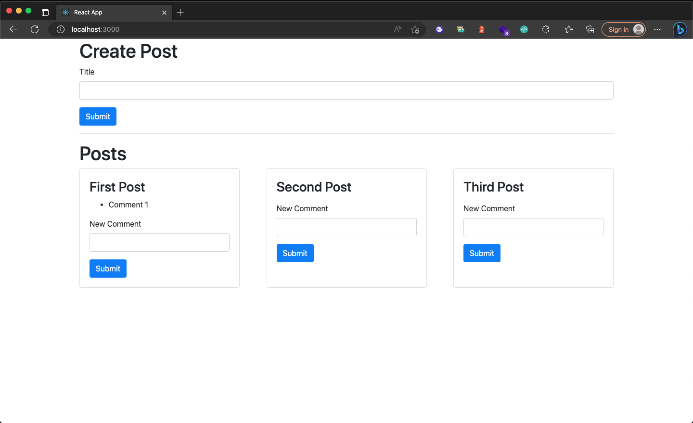
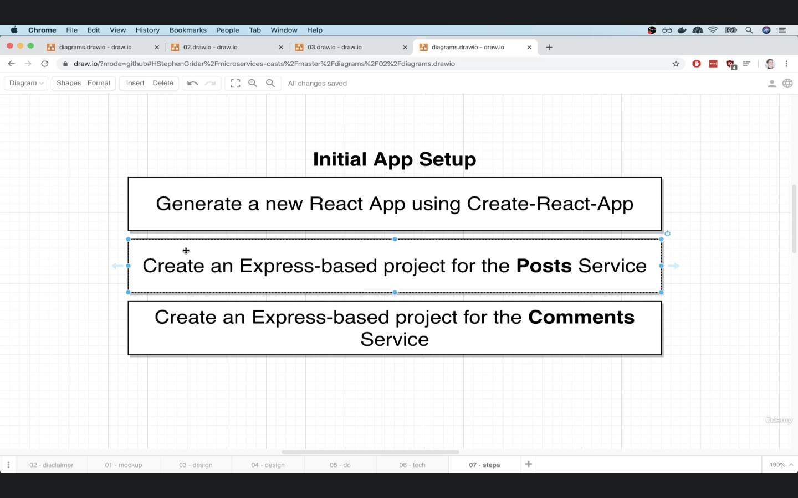
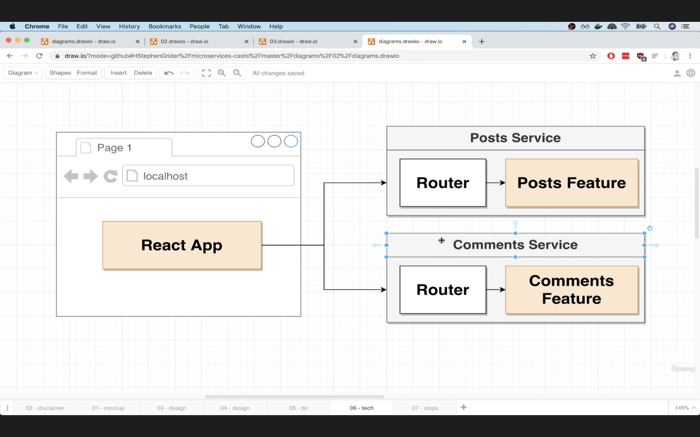
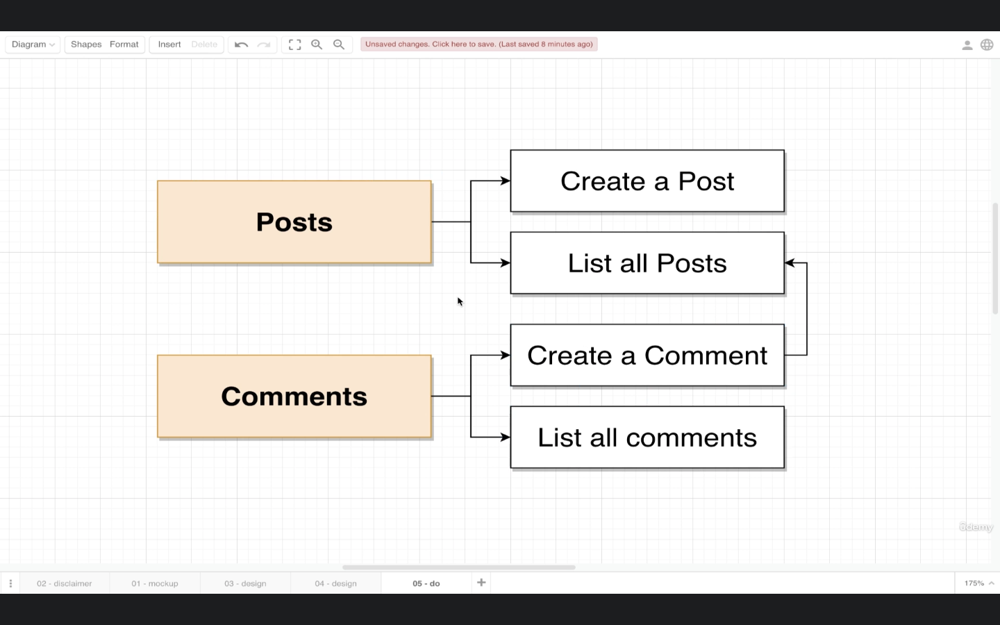

# 01-blog-simple

In this section we will learn about simple React application used Posts service and Comments service with `common` HTTP request style `without` service communitcation between services.

Posts service and Comments service have own store their entity post-entity and comment-entity

## Application overview

*Our App UI*


*Initial App*


*App tasks*


*Service tasks*


## Folder structures
- /posts contain Express app for posts service entity run on port :4000
- /comments contain Express app for comments service entity run on port :4001
- /client contain React app for UI run on port :3000


## How to run example
```sh
# Posts service [port 4000]
cd posts && npm install && npm start

# Comments service [port 4001]
cd comments && npm install && npm start

# React Apps
cd client && npm install && npm start

```

Open web browser to [http://localhost:3000](https://localhost:3000)