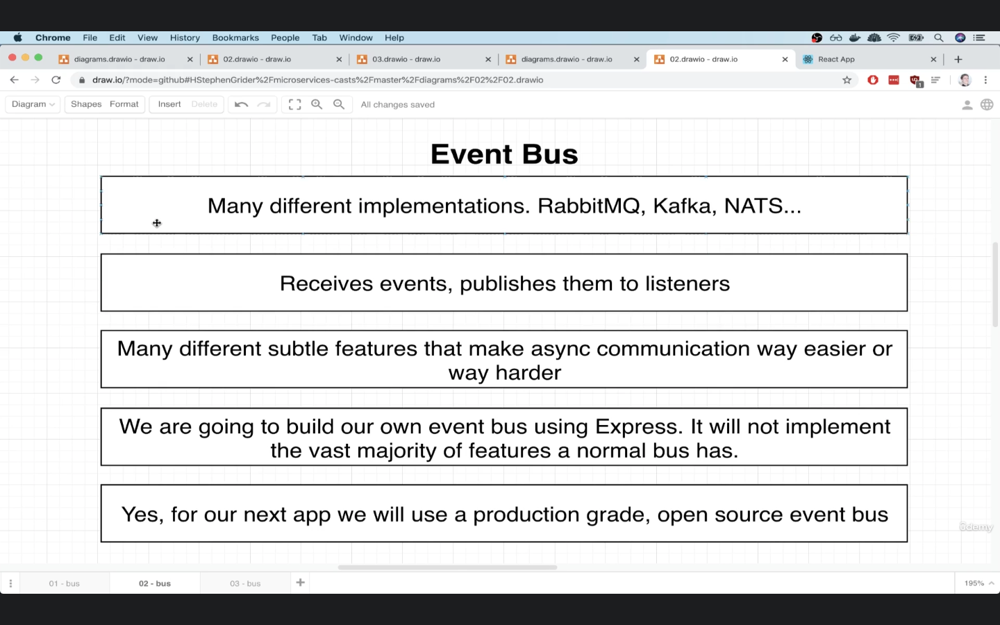
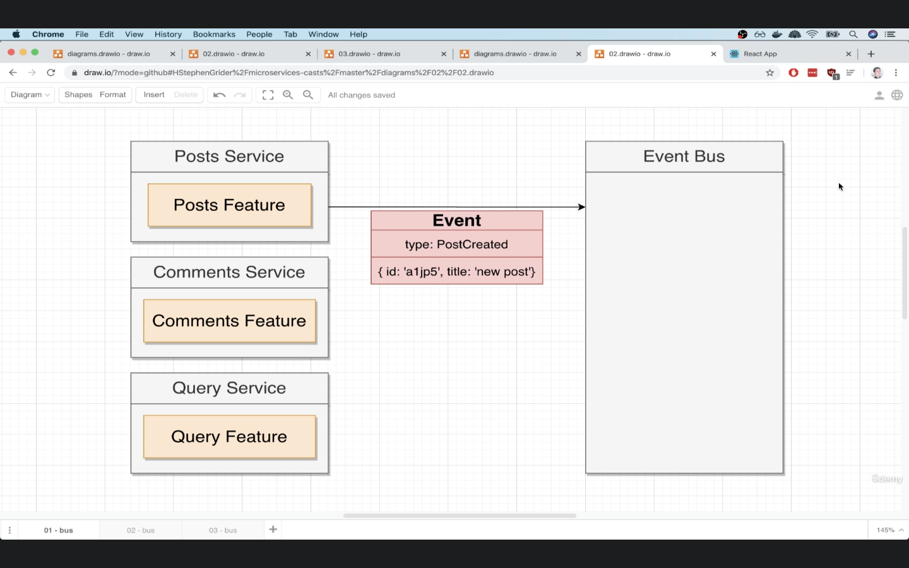
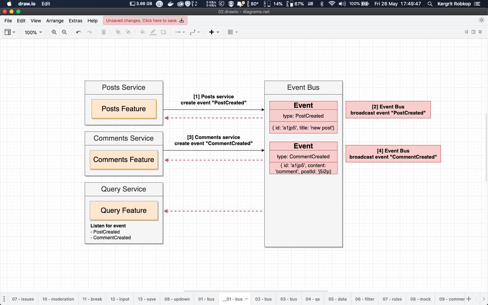
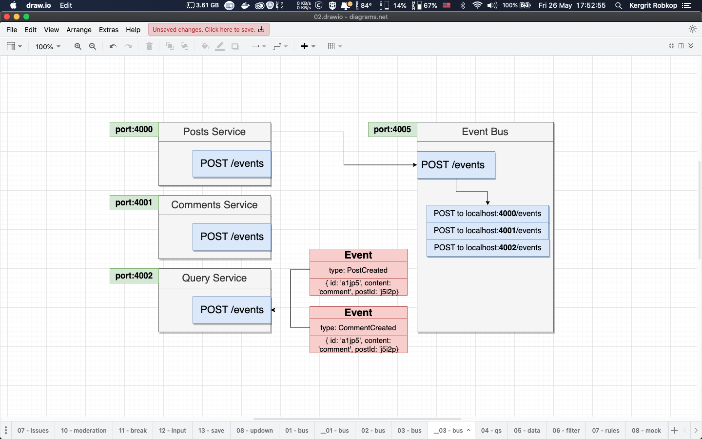
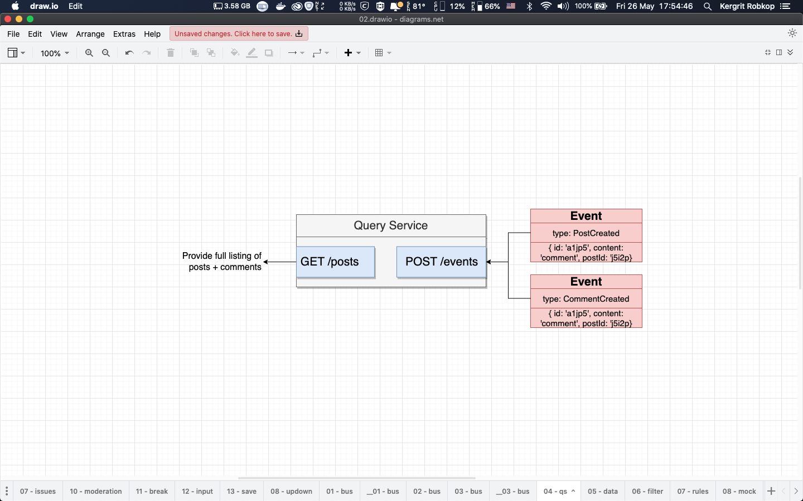
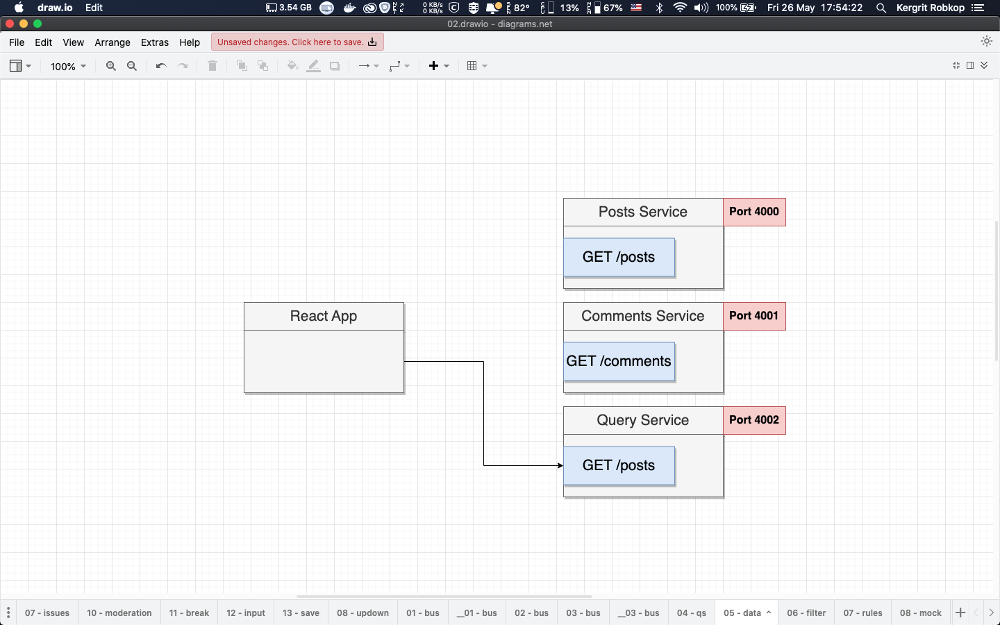

# 02-blog-event-bus

In this section we will learn about simple React application used Posts service, Comments service and Query service with `Event Bus` service communitcation between services.

Posts service, Comments service and Query service have own store their entity post-entity, comment-entity and post-comment-entity

## Application overview
*Event Bus is*


*postCreated Event*


*Event Bus Flows*


*Event Bus Implementations*


*Query service tasks*


*Update get posts+comments entity from Query service*



## Folder structures
- `/posts` contain Express app for posts service entity run on `port:4000`
- `/comments` contain Express app for comments service entity run on `port:4001`
- `/query` contain Express app for Query service entity run on `port:4002`
- `/event-bus` contain Express app for `Event Bus` to collect event run on `port:4005`
- `/client` contain React app for UI run on `port:3000`


## How to run example
```sh
#  Event Bus [port:4005]
cd event-bus && npm install && npm start

# Posts service [port:4000]
cd posts && npm install && npm start

# Comments service [port:4001]
cd comments && npm install && npm start

# Query service [port:4002]
cd query && npm install && npm start

# React Apps [port:3000]
cd client && npm install && npm start

```

Open web browser to [http://localhost:3000](http://localhost:3000)

# 
*Test scenario*
- Add first post
- Add first comment and second comment
- Reload web browser and see results
- Kill post service and comment service with `ctrl+c`
- Add second post
- Reload web browser and see results (app will display posts data `without cash!!`) but can't create any post and comment anymore