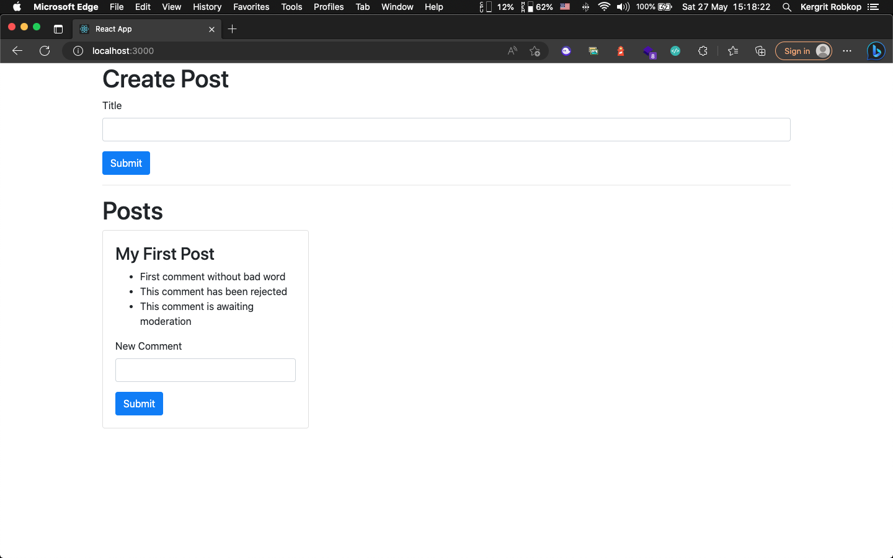
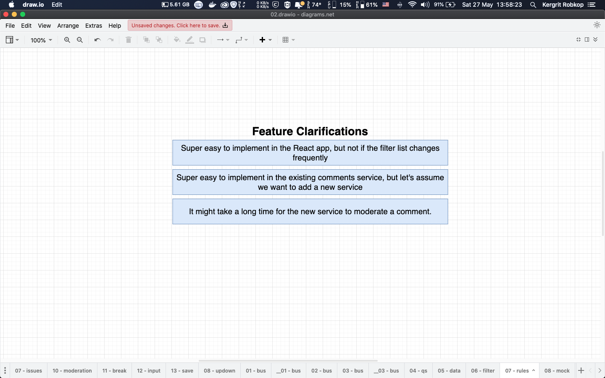
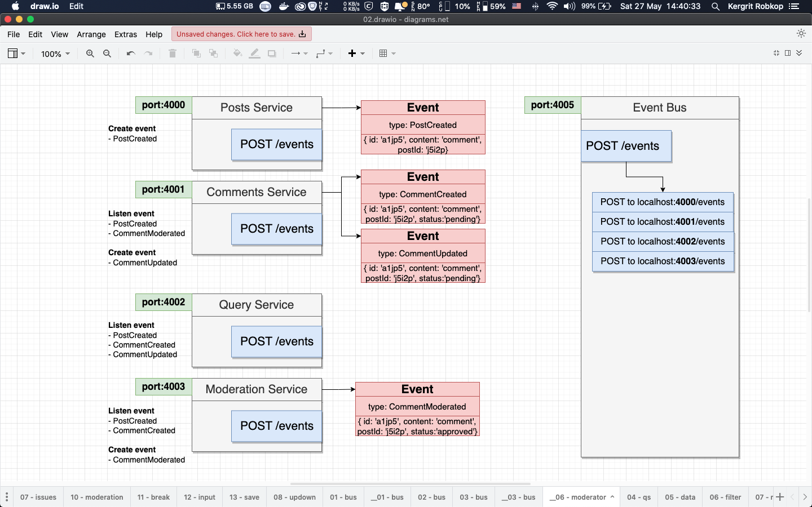
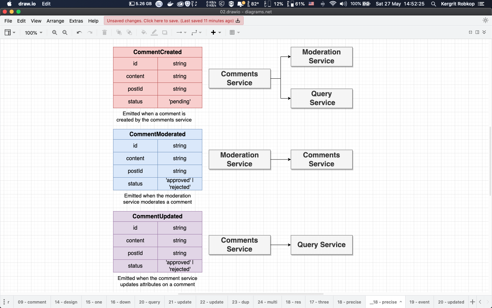

# 03-blog-moderation

In this section we will learn about simple React application used Posts service, Comments service, Moderation service and Query service with `Event Bus` service communitcation between services.

Posts service, Comments service and Query service have own store their entity post-entity, comment-entity and post-comment-entity (changes some entity data structure for Moderation service)

Moderation service not store any entity also update comment status with `pending` `approved` and `rejected` from event bus on `commentCreated` after finish moderated this service send `commentModerated` to event bus

Event Bus lists
- `postCreated` triggered on post item was created
- `commentCreated` triggered on comment item was crated
- `commentModerated` triggered on comment item was moderated
- `commentUpdated` triggered on comment item was updated

## Application overview

*Project UI*


*Feature detail*


*Event Bus Routes*


*Event Bus Data*


*Event Bus Flow*
- User add new comment form UI
- `Comment service` create comment entity with `pending` status. Then create & send `commentCreated` event to Event Bus
- `Query service` receive `commentCreated` event and create post-comment entity.
- `Moderation service` receive `commentCreated` event and checking bad word in content and update status to `approved` or `rejected`. Next create & send `commentModerated` event to Event Bus
- `Comment service` receive `commentModerated` event and update own comment entity. Then create & send `commentUpdated` event to Event Bus
- `Query service` receive `commentUpdated` event and update own post-comment entity

## Folder structures
- `/posts` contain Express app for posts service entity run on `port:4000`
- `/comments` contain Express app for comments service entity run on `port:4001`
- `/query` contain Express app for Query service entity run on `port:4002`
- `/moderation` contain Express app for Moderation service entity run on `port:4003`
- `/event-bus` contain Express app for `Event Bus` to collect event run on `port:4005`
- `/client` contain React app for UI run on `port:3000`

## How to run example
```sh
# Event Bus [port:4005]
cd event-bus && npm install && npm start

# Posts service [port:4000]
cd posts && npm install && npm start

# Comments service [port:4001]
cd comments && npm install && npm start

# Query service [port:4002]
cd query && npm install && npm start

# Moderation service [port:4003]
cd moderation && npm install && npm start

# React Apps [port:3000]
cd client && npm install && npm start

```

Open web browser to [http://localhost:3000](https://localhost:3000)

# 
*Test scenario*
- Add first post
- Add first comment with bad word "orange"
- Add first comment without bad word 
- Reload web browser and see results
- Kill `Moderation service` with `ctrl+c`
- Add third post
- Reload web browser and see results