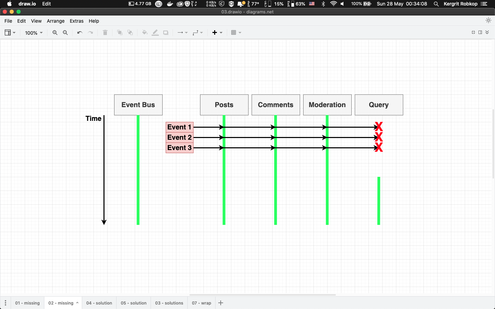
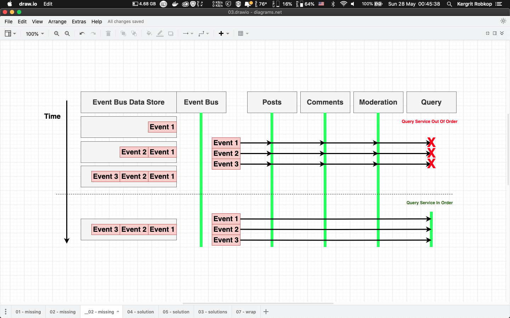

# 04-blog-deal-with-missing-event

In this section we will learn about simple React application used Posts service, Comments service, Moderation service and Query service with `Event Bus` service communitcation between services.

In real-world of microservices we will found situation some service out of service and missing recive event from Event Bus. In this section make `Query Service` is out of service and missing receive `postCreated` and `commentCreated` from Event Bus. Then restart `Query Service` after create post and comment. You can see how to handle and sync missing event in `Query Service`.

## Application overview
*Problem: Query service out of order*


*Solution: Event Bus datastore*

## Folder structures
- `/posts` contain Express app for posts service entity run on `port:4000`
- `/comments` contain Express app for comments service entity run on `port:4001`
- `/query` contain Express app for Query service entity run on `port:4002`
- `/moderation` contain Express app for Moderation service entity run on `port:4003`
- `/event-bus` contain Express app for `Event Bus` to collect event run on `port:4005`
- `/client` contain React app for UI run on `port:3000`

## How to run example
```sh
# Event Bus [port:4005]
cd event-bus && npm install && npm start

# Posts service [port:4000]
cd posts && npm install && npm start

# Comments service [port:4001]
cd comments && npm install && npm start

# Query service [port:4002]
cd query && npm install && npm start

# Moderation service [port:4003]
cd moderation && npm install && npm start

# React Apps [port:3000]
cd client && npm install && npm start

```

Open web browser to [http://localhost:3000](https://localhost:3000)

# 
*Test scenario*
- Add first post
- Add first comment
- Reload web browser and see results 
- Kill `Query service` with `ctrl+c`
- Add second post
- Add second comment
- Reload web browser and see results 
- Restart `Query service`
- Reload web browser and see results