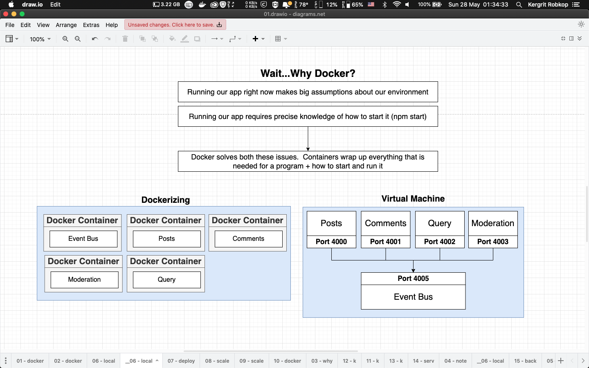

## 05-blog-run-service-with-docker

In last section we will learn about simple React application used Posts service, Comments service, Moderation service and Query service with `Event Bus` service communitcation between services.

In this section we will learn about wrap all service with docker

## Application overview
*Dockerizing*



Apply .dockerignore and Dockerfile to all services
```docker
# .dockerignore
node_modules
package-lock.json
```

```docker
# Dockerfile
FROM node:alpine

WORKDIR /app
COPY package.json ./
RUN npm install
COPY ./ ./

CMD ["npm", "start"]
```

## Folder structures
- `/posts` contain Express app for posts service entity run on `port:4000`
- `/comments` contain Express app for comments service entity run on `port:4001`
- `/query` contain Express app for Query service entity run on `port:4002`
- `/moderation` contain Express app for Moderation service entity run on `port:4003`
- `/event-bus` contain Express app for `Event Bus` to collect event run on `port:4005`
- `/client` contain React app for UI run on `port:3000`

## How to run example
```sh
# Event Bus [port:4005]
cd event-bus && docker build -t kergrit/05-blog-event-bus . && docker run -it kergrit/05-blog-event-bus

# Posts service [port:4000]
cd posts && docker build -t kergrit/05-blog-posts . && docker run -it kergrit/05-blog-posts

# Comments service [port:4001]
cd comments && docker build -t kergrit/05-blog-comments . && docker run -it kergrit/05-blog-comments

# Query service [port:4002]
cd query && docker build -t kergrit/05-blog-query . && docker run -it kergrit/05-blog-query

# Moderation service [port:4003]
cd moderation && docker build -t kergrit/05-blog-moderation . && docker run -it kergrit/05-blog-moderation

# React Apps [port:3000]
cd client && docker build -t kergrit/05-blog-client . && docker run -it kergrit/05-blog-client

```
** Remark we not yet expose port this is a only simple dockerizing you can't open browser to test scenario **

# 
Docker command
```sh
# Docker build image
docker build -t {image-name}:{version} .

# Docker run image
docker run -it {image-name}:{version}
```