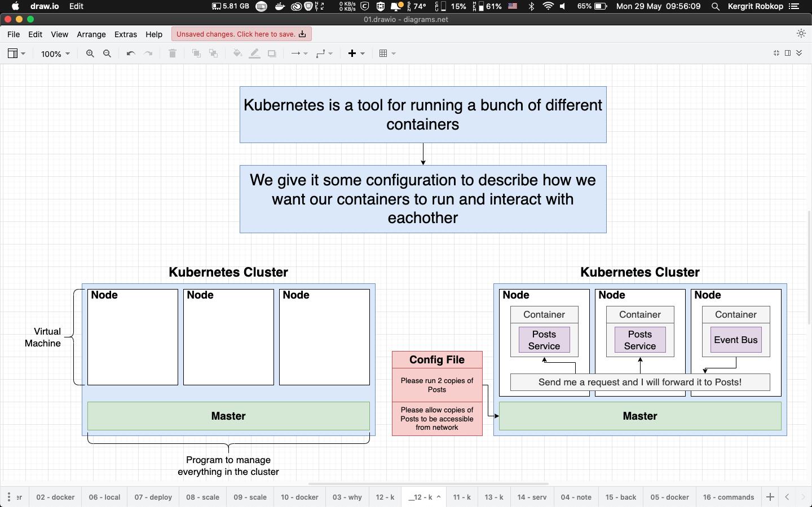
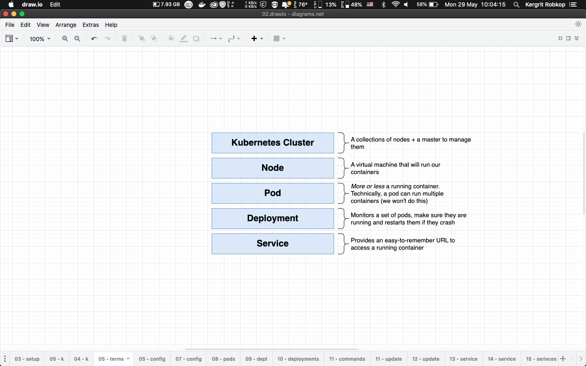
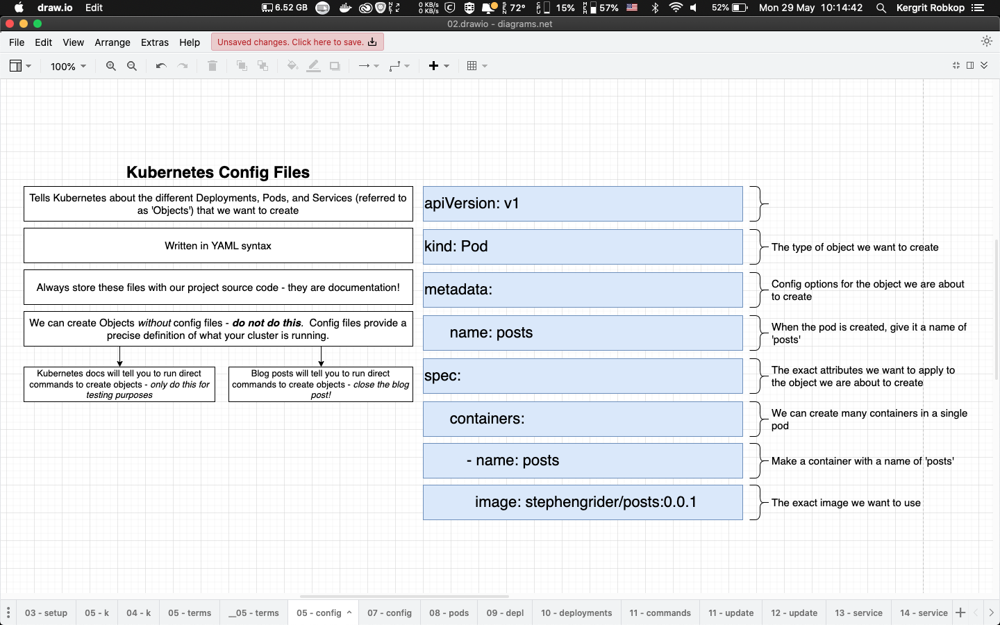
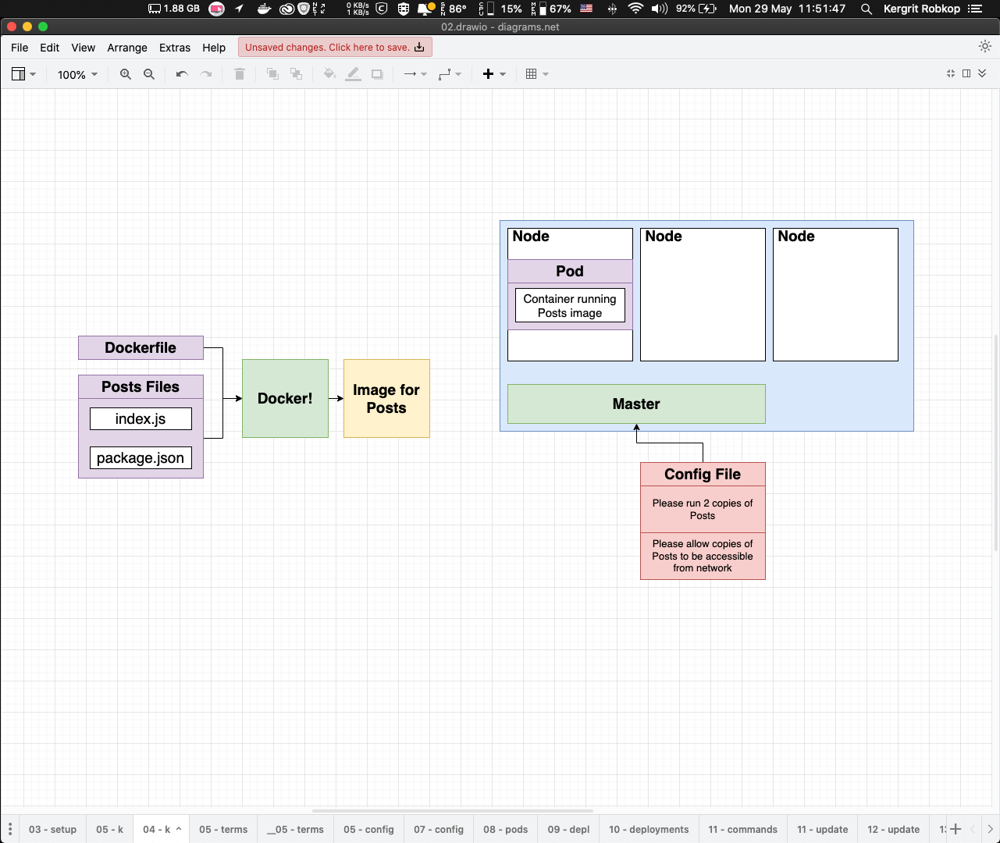
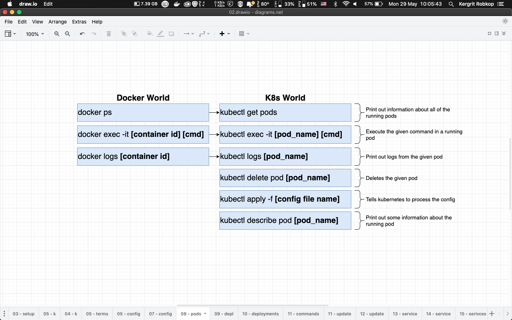
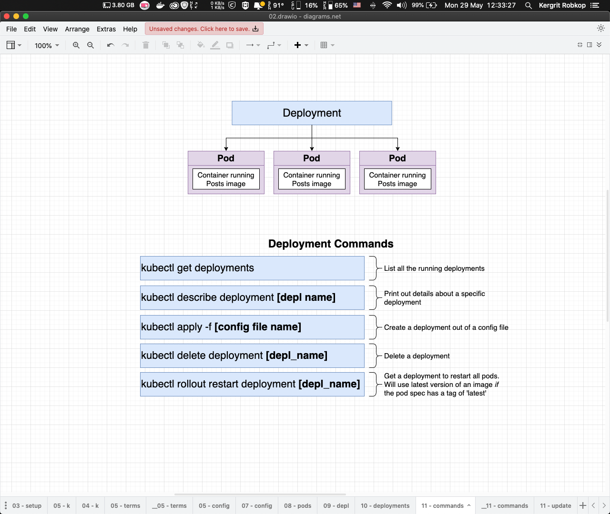
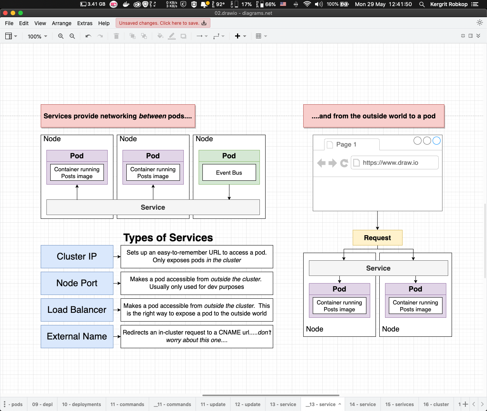
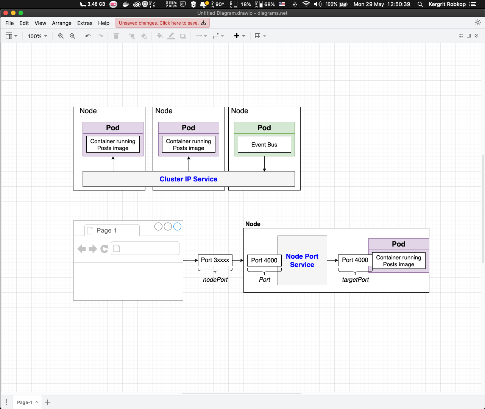
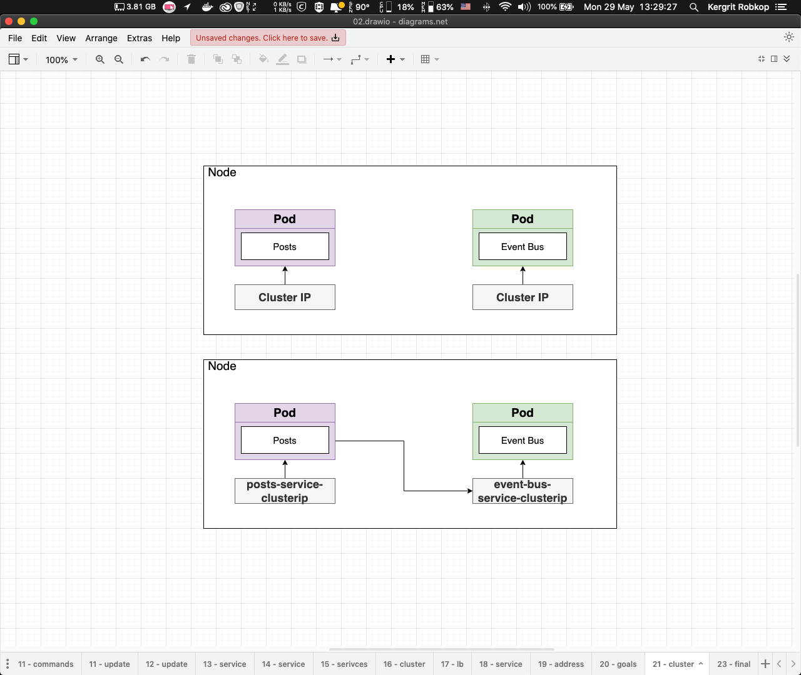

## 06-blog-kubernetes-101

In last section we will learn about simple orchesting blog app with `Kubernetes` or `k8s` in short.

Start section with simple knowledge what is kubernetes and how it work.

## What is Kubernetes (Kube or K8S)
*What is K8S?*


*Kubernetes Terms*



*Pod Term - Config file*


Simple kubernetes Pod config
```yaml
# infra/k8s-simple/posts-pod.yaml
apiVersion: v1
kind: Pod
metadata:
  name: posts
  labels:
    name: posts
spec:
  containers:
  - name: posts
    image: kergrit/06-blog-posts:simple
```

```sh
// Docker build & push image 
cd posts && \
docker build -t kergrit/06-blog-posts:simple . && \
docker push kergrit/06-blog-posts:simple \

// K8s Pod 
cd infra/k8s-simple && \
kubectl apply -f posts-pod.yaml && \
kubectl get pods
```

*Pod Term - Docker world vs Kubernetes world*


*Deployment Term*


Simple kubernetes Deployment config
```yaml
# infra/k8s-simple/posts-deployment.yaml
apiVersion: apps/v1
kind: Deployment
metadata:
  name: posts-deployment
spec:
  replicas: 1
  selector:
    matchLabels:
      app: posts
  template:
    metadata:
      labels:
        app: posts
    spec:
      containers:
      - name: posts
        image: kergrit/06-blog-posts:simple
```

```sh
// K8s Deployment 
cd infra/k8s-simple && \
kubectl apply -f posts-deployment.yaml && \
kubectl get deployments
```

*Service Term*


*Service Term - Node Port*


Simple kubernetes Service config (NodePort)
```yaml
# infra/k8s-simple/posts-service-nodeport.yaml
apiVersion: v1
kind: Service
metadata:
  name: posts-service-nodeport
spec:
  type: NodePort
  selector:
    app: posts
  ports:
  - port: 4000
    targetPort: 4000
```
```sh
// K8s Service
cd infra/k8s-simple && \
kubectl apply -f posts-deployment.yaml && \
kubectl apply -f posts-service-nodeport.yaml && \
kubectl get services

// Accessing NodePort example 192.168.64.10:30614
minikube ip
```
Open web browser to http://192.168.64.10:30614/posts

*Service Term - ClusterIP*

Simple kubernetes Service config (ClientIP)
```yaml
# infra/k8s-simple/posts-service-clusterip.yaml
apiVersion: v1
kind: Service
metadata:
  name: posts-service-clusterip
spec:
  selector:
    app: posts
  ports:
  - port: 4000
    targetPort: 4000

# infra/k8s-simple/event-bus-service-clusterip.yaml
apiVersion: v1
kind: Service
metadata:
  name: event-bus-service-clusterip
spec:
  selector:
    app: event-bus
  ports:
  - port: 4005
    targetPort: 4005
```

```js
// update posts and event-bus service endpoint from http://localhost with http://ClusterIP NAME
let post_service_endpoint = 'http://posts-service-clusterip:4000';
let event_bus_service_endpoint = 'http://event-bus-service-clusterip:4005';
```

## Folder structures
- `/posts` contain Express app for posts service entity run on `port:4000`
- `/comments` contain Express app for comments service entity run on `port:4001`
- `/query` contain Express app for Query service entity run on `port:4002`
- `/moderation` contain Express app for Moderation service entity run on `port:4003`
- `/event-bus` contain Express app for `Event Bus` to collect event run on `port:4005`
- `/client` contain React app for UI run on `port:3000`
- `/infra/k8s-simple` contain configuration file for K8s

## How to run example

```sh
// Build & push event-bus image to docker hub
cd event-bus && \
docker build -t kergrit/06-blog-event-bus:simple . && \
docker push kergrit/06-blog-event-bus:simple

// Deployment
cd infra/k8s-simple && \
kubectl apply -f posts-deployment.yaml && \
kubectl apply -f event-bus-deployment.yaml && \
kubectl get deployments

// Service
cd infra/k8s-simple && \
kubectl apply -f posts-service-clusterip.yaml && \
kubectl apply -f event-bus-service-clusterip.yaml && \
kubectl get services
```

*Test scenario (Test connection with Postman)*
- `GET` http://192.168.64.10:31553/posts
```sh
curl --location 'http://192.168.64.10:31553/posts'
```
- `POST` http://192.168.64.10:31553/posts
```sh
curl --location 'http://192.168.64.10:31553/posts' \
--header 'Content-Type: application/json' \
--data '{
    "title":"My Post#1"
}'
```
- Lists all pods
```sh
kubectl get pods
```
- See result with `kubectl logs`
```sh 
kubectl logs posts-deployment-c68469c7-4h8cf && \
kubectl logs event-bus-deployment-5c67958f49-jg57r
```
# 
Kubernetes command
```sh
# Create/update K8s with configuration (pods,deployments and services)
kubectl apply -f {configFile}
kubectl apply -f {FolderOfConfigFile}

# Delete K8s with configuration (pods,deployments and services)
kubectl delete -f {configFile}
kubectl delete -f {FolderOfConfigFile}

# Delete K8s with type and name
kubectl delete {pod|deployment|service} {podName|deploymentName|serviceName}

# Describe K8s with type and name
kubectl describe {pod|deployment|service} {podName|deploymentName|serviceName}

# Listing K8s with type
kubectl get {pods|deployments|services}

# Execute command on some pod
kubectl exec -it {podName} {command}

# Print logs on some pod
kubectl logs {podName}

# Get minikube ip (VM)
minikube ip
```