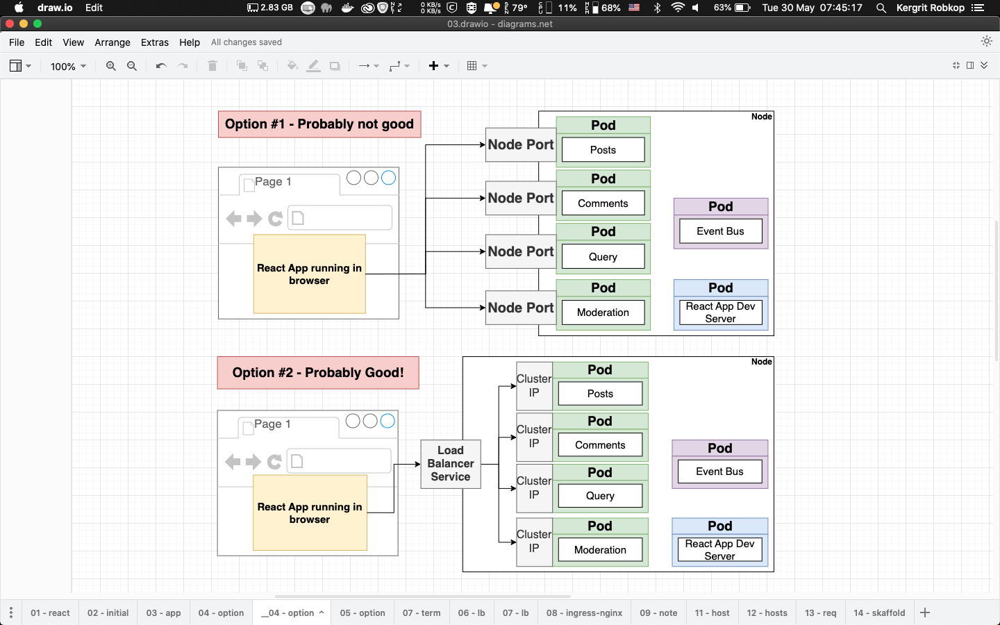
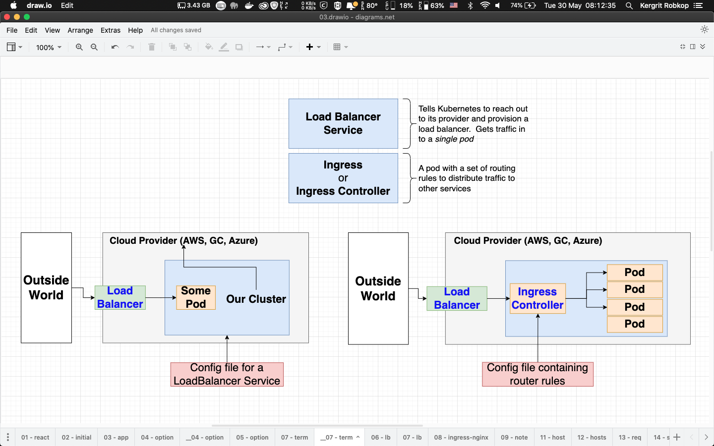
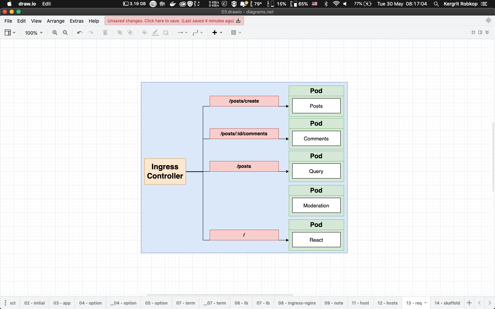

## 07-blog-k8s-loadbalancer-ingress

In this section we will learn about simple orchesting blog app with `Kubernetes` with `Load Balancer` and `Ingress`.

From latest section we expose `Posts service` (Pod) to outside world (Internet) to access via `NodePort` at `port:4000`

Next if we want to outside world can access another `Services` (Pods) how we do?
- Option #1 - Probably not good defined every service (pod) with `NodePort`
- Option #2 - Probably good! using `Load Balancer Service`

*Option 1 & 2*



*Service Term - Load Balancer & Ingress Controller*



*Our Blog Ingress Controller Routes*


> **!! Ingress Controller** use `URL path` for route to `Service` that not provide `GET` `POST` request methods. So in our blog app are duplicate `/posts` on `Posts service` and `Query service` then we must update `URL path` of `Post Service` with `/posts/create` insted

> **!! Every changes** codebase you must rebuild docker image and push to docker hub and run `kubectl rollout restart deployment {deploymentName}` for updating K8s deployment. 
  - *Question*: What tool will help us automately this tasks on tasks development process. 
  - *Answer*: `Scaffold`

With `nginx-ingress` for K8s you can deploy multiple domain or apps to single K8s cluster 

```sh
# /etc/hosts
192.168.64.10   blog.app
```

```yaml
# Sample nginx-ingress rules for /posts
apiVersion: networking.k8s.io/v1
kind: Ingress
metadata:
  name: blog-app-ingress
  labels:
    name: blog-app-ingress
  annotations:
    kubernetes.io/ingress.class: nginx
spec:
  rules:
  - host: blog.app
    http:
      paths:
      - pathType: Prefix
        path: "/posts"
        backend:
          service:
            name: posts-service-clusterip
            port: 
              number: 4000
...
```

> More information about ingress routes path see [Ingress Path Matching](https://kubernetes.github.io/ingress-nginx/user-guide/ingress-path-matching/)

```sh
# Build & Push docker image
cd posts && \
docker build -t kergrit/07-blog-posts . && \
docker push kergrit/07-blog-posts

# Deployment Service Ingress
cd infra/k8s && \
kubectl apply -f posts-deployment-service.yaml && \
kubectl apply -f ingress-service.yaml

# Lists
kubectl get deployments && \
kubectl get services && \
kubectl get pods
```

Open web browser http://blog.app/posts

> When you access blog.app K8s will redirect to `https://` by default for secured. Next you will apply `tls/ssl` with article [How To Configure Ingress TLS/SSL Certificates in Kubernetes](https://devopscube.com/configure-ingress-tls-kubernetes/)

#
For more informations and examples [hello-app-ssl](infra/hello-app-ssl)
#