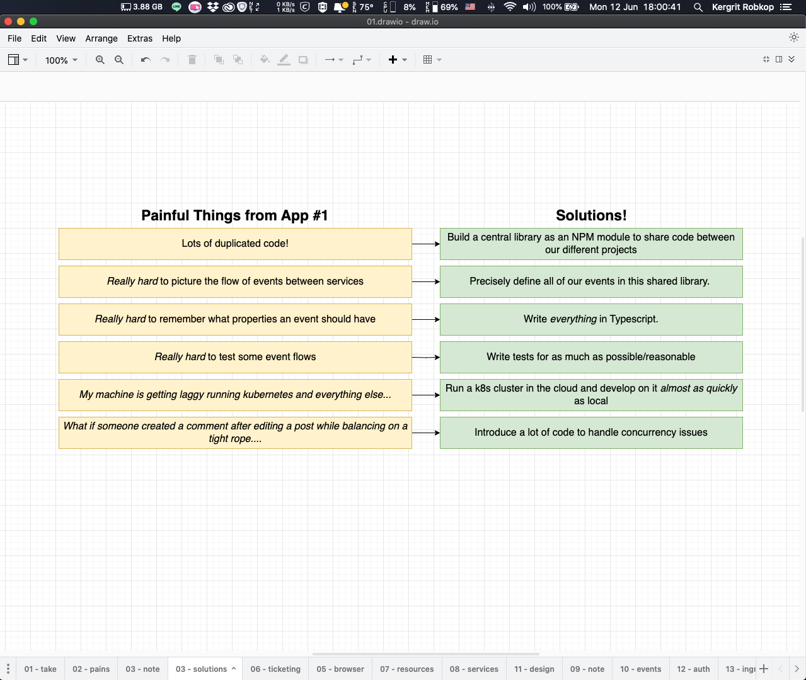
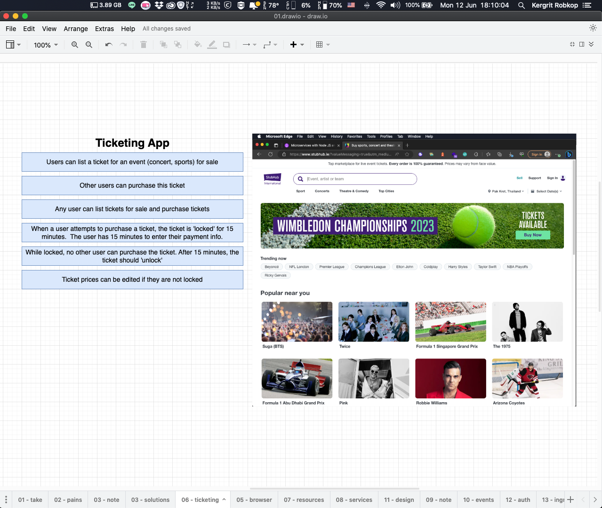
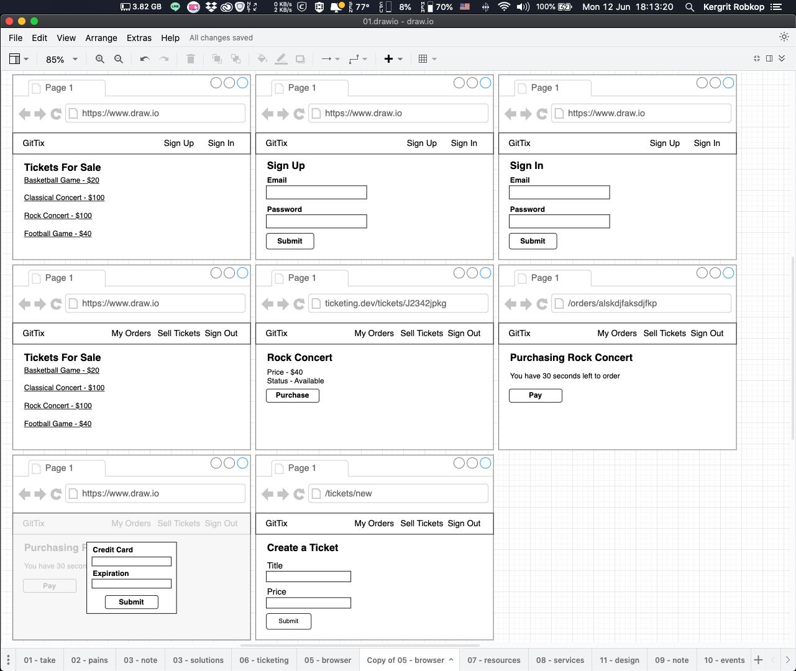
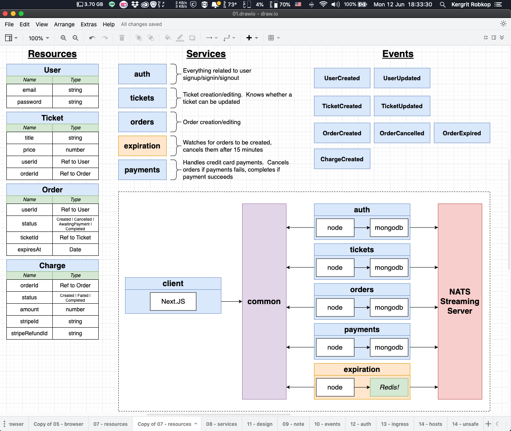

# 09-tickets-overview

In this section we will learn about tickets `NextJS` application use microservice design and development with `TypeScript`

## Application overview
Our application inspired by [Stubhub](https://www.stubhub.ie/) marketplace web application to sell & buy tickets.

In the latest section we learned about simple concept of micro service design & development. Now we see some painful of blog application.

*Painful & Solution*


Next we will create a marketplace app with solutions to solve painful things from blog app.

*Tickets app goal*


*Tickets app UI*
 

*Tickets app microservice design*


>At design microservice step we start with defined resource types, services and events

### Resource Types (Entity)
Define data structures (entity) on system
- User
- Ticket
- Order
- Charge

### Services
Define micro service to manipulate entity on system
- auth related to *User* entity
  |             |                         |                                      |                                 |
  |-------------|-------------------------|--------------------------------------|---------------------------------|
  | **Method**  | **Routes**              | **Body**                             | **Purpose**                     |
  | POST        | /api/users/signup       | { email: string, password: string }  | Sign up for an account          |
  | POST        | /api/users/signin       | { email: string, password: string }  | Sign in to an existing account  |
  | POST        | /api/users/signout      | {}                                   | Sign out                        |
  | GET         | /api/users/currentuser  | -                                    | Return info about the user      |
  |             |                         |                                      |                                 |
- tickets related to *Ticket* entity
  |             |                         |                                      |                                 |
  |-------------|-------------------------|--------------------------------------|---------------------------------|
  | **Method**  | **Routes**              | **Body**                             | **Purpose**                     |
  | POST        | /api/users/signup       | { email: string, password: string }  | Sign up for an account          |
  |             |                         |                                      |                                 |
- orders related to *Order* entity
  |             |                         |                                      |                                 |
  |-------------|-------------------------|--------------------------------------|---------------------------------|
  | **Method**  | **Routes**              | **Body**                             | **Purpose**                     |
  | POST        | /api/users/signup       | { email: string, password: string }  | Sign up for an account          |
  |             |                         |                                      |                                 |
- expiration
  |             |                         |                                      |                                 |
  |-------------|-------------------------|--------------------------------------|---------------------------------|
  | **Method**  | **Routes**              | **Body**                             | **Purpose**                     |
  | POST        | /api/users/signup       | { email: string, password: string }  | Sign up for an account          |
  |             |                         |                                      |                                 |
- payments related to *Charge* entity
  |             |                         |                                      |                                 |
  |-------------|-------------------------|--------------------------------------|---------------------------------|
  | **Method**  | **Routes**              | **Body**                             | **Purpose**                     |
  | POST        | /api/users/signup       | { email: string, password: string }  | Sign up for an account          |
  |             |                         |                                      |                                 |

### Events
Defined any events occured on system related to entity
- UserCreated
- UserUpdated
- OrderCreated
- OrderCancelled
- OrderExpired
- TicketCreated
- TicketUpdated
- ChargeCreated


## Folder structures
- `/auth` contain Express(TypeScript) app for auth service on port `:3000`


## Auth service setup
```sh
# initial auth service nodejs project
mkdir auth
cd auth
npm init -y

# install package typescript ts-node-dev and express
npm install typescript ts-node-dev express @types/express

# add tsconfig.json
tsc --init

# add boostrap app on src/index.ts
mkdir src
cd src
touch index.ts

# update start command on package.json to
...
"start" : "ts-node-dev src/index.tx"
...

# testing with 
npm start
```

## How to run example
```sh
cd ./auth
npm install
npm start
```