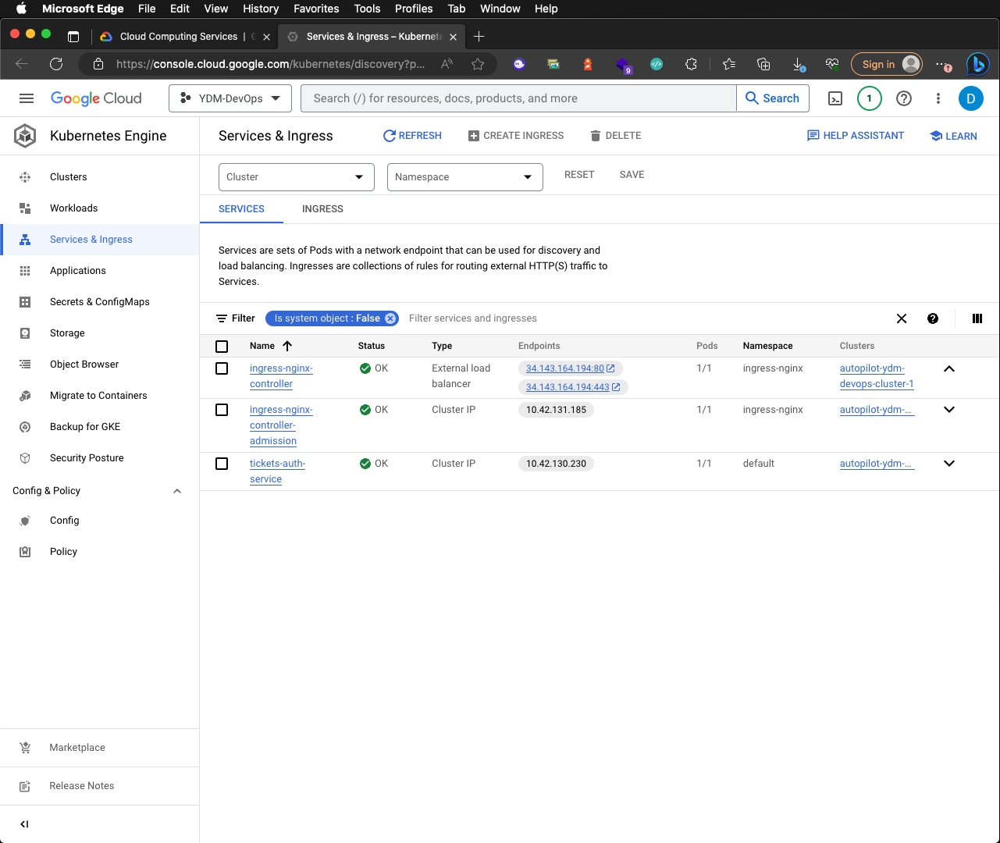

# 11-tickets-k8s-remote-dev-with-gc (optional)

In this section we will setting up k8s and skaffold for our project for remote development with GC (Google Cloud)

*Optional section*


## Folder structures
- `/auth` contain Express(TypeScript) app for auth service on port `:3000`

## Auth service setup (k8s+nginx-ingress+skaffold) Remote Dev with GC
```sh
# enable gcloud account
# gcloud GKE setup
# gcloud Build setup
# update skaffold linked to gcloud
```

## GKE setup
*GKE - create k8s cluster*


*GKE - k8s networking*


*GKE - k8s advanced settings*


*GKE - k8s review and create*


*GKE - k8s dashboard*


*GKE - k8s connect*


## K8s Context (Clusters)
After install minikube for local k8s the clusters minikube are created by default. Now you create another cluster (context) on GKE we can switch between clusters to manage k8s on different cluster

```sh
# display all clusters & contexts
kubectl config get-clusters
kubectl config get-contexts

# switch context
kubectl config set-context minikube
```

## Install the Google Cloud CLI
Following this link [https://cloud.google.com/sdk/docs/install-sdk](https://cloud.google.com/sdk/docs/install-sdk)

```sh
# download google cli
wget https://dl.google.com/dl/cloudsdk/channels/rapid/downloads/google-cloud-cli-434.0.0-darwin-x86.tar.gz

# extract file
tar xvfz google-cloud-cli-434.0.0-darwin-x86.tar.gz

# install google cli
./google-cloud-sdk/install.sh

# initial 
gcloud init

# login 
gcloud auth login
```

## Add Google Cloud Context
Now we need to add k8s context from gcloud with 2 options
- don't want to run docker at all
- still running docker

*K8s contexts*

```sh
# add gcloud context
gcloud container clusters get-credentials autopilot-ydm-devops-cluster-1 --location=asia-southeast1

# display all contexts
kubectl config get-contexts

# switch context
kubectl config set-context minikube
```

## Update skaffold and enable gcloud build
Now we need to update some configuration skaffold build with gcloud build and deploy container to gcloud k8s context

*Step*


```sh
# Enable gcloud Build
https://console.cloud.google.com/cloud-build

# Enable gcloud Artifact Registry / Containers
https://console.cloud.google.com/artifacts

# Update skaffold.yaml
...
build:
  googleCloudBuild:
    projectId: ydm-devops    
  artifacts:
    - image: gcr.io/ydm-devops/tickets-auth
...

# Update infra/k8s/tickets-auth-deployment.yaml
...
spec:
  containers:
  - name: tickets-auth
    image: gcr.io/ydm-devops/tickets-auth
...

# Install k8s nginx ingress controller on gke
# https://kubernetes.github.io/ingress-nginx/
kubectl create clusterrolebinding cluster-admin-binding \
  --clusterrole cluster-admin \
  --user $(gcloud config get-value account)

kubectl apply -f https://raw.githubusercontent.com/kubernetes/ingress-nginx/controller-v1.8.0/deploy/static/provider/cloud/deploy.yaml

# Restart skafflod
skaffold dev

# Check all deployments, services and pod running
kubectl get deployments
kubectl get services
kubectl get pods
kubectl get ingress

# Update hosts to load balance IP
...
34.143.164.194  tickets.app
...

# Open browser to k8s on gke
https://tickets.app/api/users/currentuser
```

*Get load balancer IP*


*Gcloud Build*


*Gcloud Container Registry*
